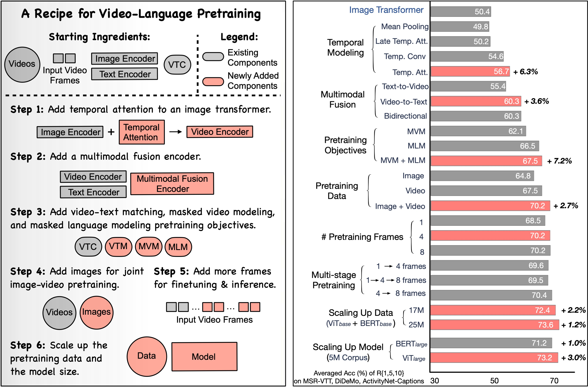
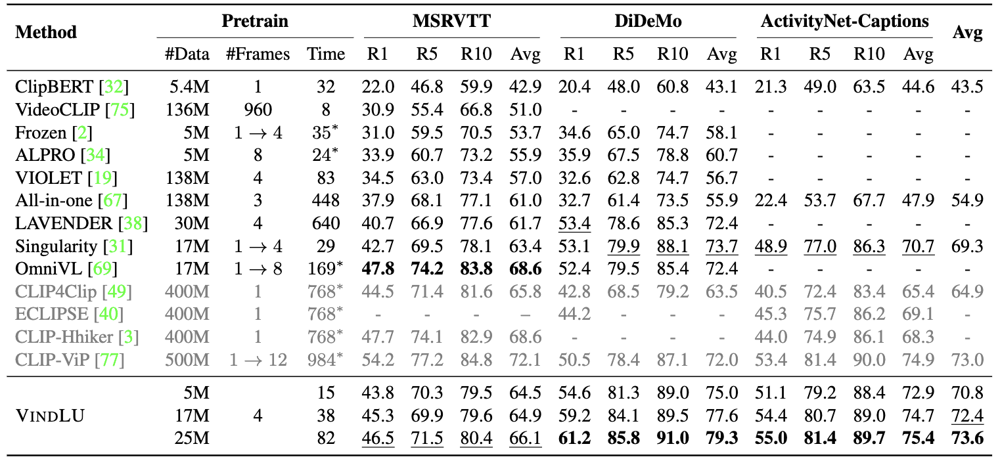
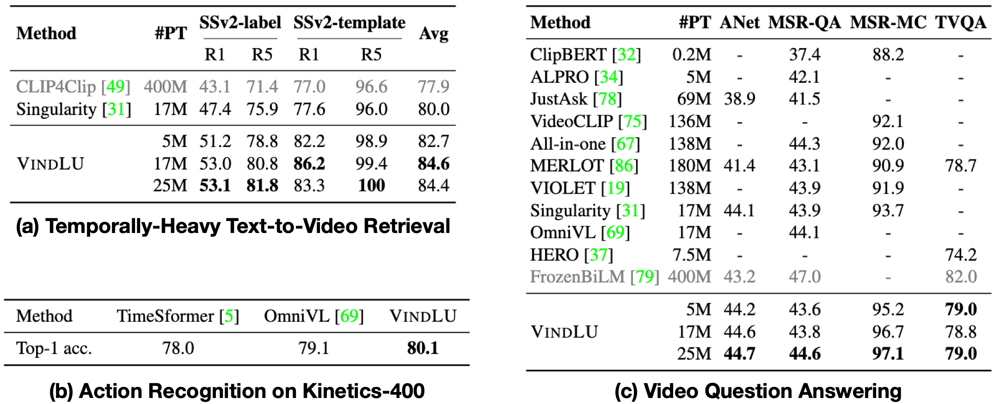

# VindLU :curry:

VindLU :curry: : A Recipe for Effective Video-and-Language Pretraining [[arXiv]()] [[project page](https://klauscc.github.io/vindlu.html)]

[Feng Cheng](https://klauscc.github.io), [Xizi Wang](), [Jie Lei](https://jayleicn.github.io/), [David Crandall](https://luddy.indiana.edu/contact/profile/?David_Crandall), [Mohit Bansal](http://www.cs.unc.edu/~mbansal/), [Gedas Bertasius](https://www.gedasbertasius.com/)


Official PyTorch code for VindLU, a recipe for effective Video-and-Language (VidL) Pretraining. 

#### Highlights:
- Revealed the importance of each component in VidL pretraining (see our paper for details).
- Cheap to train: 82 V100 GPU days to train on joint 10M video and 15M image datasets; 15 V100 days on 5M datasets.
- State-of-the-art performance on video retrieval task and VidQA task. Specifically, our model achieves 61.2%(**+7.8%**) R@1 on DiDeMo and 55.0%(**+6.1%**) on ActivityNet-Captions.

<p align="center">

</p>

#### Performance

##### Text-to-video Retrieval
<p align="center">

</p>

##### More Tasks
<p align="center">

</p>


## Setup


The specific packages used in our experiment are detailed in [vl.yml](vl.yml), you can easily create a conda env containing these packages.
```bash
# create 
conda env create -f vl.yml
# activate
conda activate vl
```

In your `~/.bashrc` file, set the environment variables:
```bash
export VL_EXP_DIR="/path/to/ckpts_and_logs"
export VL_DATA_DIR="/path/to/data"
```
The datasets are stored under `$VL_DATA_DIR` and experiment outputs are stored under `$VL_EXP_DIR`.
These variables are accessed by the config files in the [configs/](configs) directory.

[Optional] Our codebase support using [wandb](https://wandb.ai/) to monitor training. If you want to use wandb, you will need to set up it following [this very short instruction](https://docs.wandb.ai/quickstart#1.-set-up-wandb), and also set `wandb.enable` in the [configs](configs) to be `True`.


### Data

Put your data following the following structure:

```
$VL_DATA_DIR
    |-- anno_pretrain     
        |-- webvid_train.sqlite.db
        |-- ...
    |-- anno_downstream
        |-- didemo_ret_train.json
        |-- ...
    |-- videos_images
        |-- webvid_2fps_224
            |-- 1053400385.mp4
            |-- ...
        |-- ...
```

**Our prepared annotations are available on [Google Drive](https://drive.google.com/drive/folders/12bC7WotvwyTG4pVvYeU4iZzmBLP1-6d9?usp=sharing).**

**Refer [DATA.md](DATA.md) to check how to prepare the image/video datasets.** 

The annotation file is in `json` format, which can be loaded as a list of dictionaries. Each dictionary is `{'image': path_to_image, 'caption': image_caption}` for image-text dataset, and is `{'image': path_to_video, 'caption': video_caption}` for video-text dataset. Note that we use the same key `image` for both image-text and video-text datasets for simplicity.

> We store the pretraining annotation files using file-based database [SQLite](https://www.sqlite.org/index.html). SQLite allows us to load the captions on demand and thus save lots of CPU memory. If using json format, the Dataloader will cost more than 200GB CPU memory for 8 GPUs and 3 workers per GPU process. This is because each worker needs to maintain a copy of the json files in memory and the json files are too large (~5GB, and will be even larger when loaded as python objects).

> You can use [create_sqlite_db.py](preprocess/create_sqlite_db.py) to convert the json annotation files into SQLite files.

### Training and Inference

All the tasks can launched via the python script `tools/run.py`. 

> It supports running with and without [slurm](https://slurm.schedmd.com/). If the server doesn't have slurm, only **single-node** multi-gpu training is supported. 

> It will use slurm if command `sbatch` exists. You can force to use local mode by add arguments `--no_slurm`.

**Our trained checkpoints are available on [Google Drive](https://drive.google.com/drive/folders/12bC7WotvwyTG4pVvYeU4iZzmBLP1-6d9?usp=sharing)**

Usage:
``` bash
python tools/run.py --slurm_args SLURM_ARGS --jobname JOBNAME \
    --dep_jobname DEP_JOBNAME \
    --nnodes NNODES --ngpus NGPUS --task TASK \
    --config CONFIG_FILE --model_args MODEL_ARGS
```
- `SLURM_ARGS`: the additional arguments for slurm. You can set the default arguments (`DEFAULT_SLURM_ARGS` in [tools/run.py](tools/run.py)). `SLURM_ARGS` will override the default arguments.
- `JOBNAME`: The experiment name and job_name in slurm. All the outputs (checkpoint and logs) will be write to `$VL_EXP_DIR/JOBNAME`.
- `DEP_JOBNAME`: The dependent job. This job will start only when `DEP_JOBNAME` is finished. You can use this feature to submit your pretraining, finetuning and evaluation jobs in the same time. Only valid when slurm is available.
- `NNODES`: The number of nodes to use. Only 1 is supported if no slurm.
- `NGPUS`: How many GPUs to use in each node.
- `TASK`: This job will run the script `tasks/TASK.py` in [tasks](tasks). Supported tasks: 
    - "pretrain": for pretraining.
    - "retrieval": for text-to-video retrieval task.
    - "retrieval_mc": for multi-choice VidQA on MSRVTT-MC dataset.
    - "vqa": for open-ended V(id)QA task.
    <!-- - "tvqa": for TVQA dataset. -->
- `CONFIG_FILE`: The path to the config file. For example, [configs/pretrain.py](configs/pretrain.py) for pretrain and [configs/ret_didemo.py](configs/ret_didemo.py) for video retrieval task on DiDeMo dataset.
- `MODEL_ARGS`: The arguments to override the predefined arguments in `CONFIG_FILE`. Format: "key1 value1 key2 value2 ...". The value of format "eval(SOME_CODE)" will be evaluated using python's [eval](https://python-reference.readthedocs.io/en/latest/docs/functions/eval.html) function.

#### Pre-Training

Example for pretraining on webvid_cc3m (5M):

``` bash
corpus="webvid_cc3m"
pt_name=pt_${corpus}_8x64
python tools/run.py --nnodes 1 --npgus 8 --task pretrain \
    --jobname $pt_name \
    --config configs/pretrain.py \
    --model_args "train_corpus ${corpus} criterion.loss_weight.vtc 1.0"
```

> Remember to add `--slurm_args SLURM_ARGS` according to your cluster's settings. The same for the following examples.

You can change `corpus` to "webvid_14m" for 17M corpus and "webvid10m_14m" for 25M corpus. 

> See variable `available_corpus` in [configs/data.py](configs/data.py) for all the supported pretraining corpus. 

> You can add your own datasets by adding them to `available_corpus`.

#### Finetuning and Evaluation

Our following examples are based on the pretrained model in the above section.

##### Text-to-video retrieval

Supported datasets: `msrvtt`, `msrvtt-9k`, `didemo`, `anet`.
Example for `msrvtt` dataset:
``` bash
dataset=msrvtt
pt_name=pt_webvid_cc3m_8x64
ft_name=ft_12frm-${pt_name}-ret_${dataset}

if [[ "$dataset" == *"msrvtt"* ]]; then ngpus=4; else ngpus=1; fi
if [[ "$dataset" == *"anet"* ]]; then nfrm_test=32; else nfrm_test=12; fi

# finetune
python tools/run.py --nnodes 1 --npgus ${ngpus} --task retrieval \
    --jobname ${ft_name} --dep_jobname ${pt_name} \
    --config configs/ret_${dataset}.py \
    --model_args "pretrained_path $VL_EXP_DIR/${pt_name}/ckpt_09.pth"

# evaluation
python tools/run.py --nnodes 1 --npgus ${ngpus} --task retrieval \
    --jobname ${ft_name}/eval_${nfrm_test}frm --dep_jobname ${ft_name} \
    --config configs/ret_${dataset}.py \
    --model_args "pretrained_path $VL_EXP_DIR/${ft_name}/ckpt_best.pth \
        evaluate True test_types 'eval([\"test\"])'  num_frames_test ${nfrm_test}" 
```

##### Video Question Answering

- Open-ended QA:

``` bash
dataset=msrvtt # supported: msrvtt, anet
pt_name=pt_webvid_cc3m_8x64
ft_name=ft_12frm-${pt_name}-qa_${dataset}

ngpus=1
if [[ "$dataset" == *"anet"* ]]; then nfrm_test=32; else nfrm_test=12; fi

# finetune
python tools/run.py --nnodes 1 --npgus ${ngpus} --task vqa \
    --jobname ${ft_name} --dep_jobname ${pt_name} \
    --config configs/qa_${dataset}.py \
    --model_args "pretrained_path $VL_EXP_DIR/${pt_name}/ckpt_09.pth"

# evaluation
python tools/run.py --nnodes 1 --npgus ${ngpus} --task vqa \
    --jobname ${ft_name}/eval_${nfrm_test}frm --dep_jobname ${ft_name} \
    --config configs/qa_${dataset}.py \
    --model_args "pretrained_path $VL_EXP_DIR/${ft_name}/ckpt_best.pth \
        evaluate True test_types 'eval([\"test\"])'  num_frames_test ${nfrm_test}" 
```

- MSRVTT-MC (multiple-choice). We directly evaluate using the fintuned retrieval model.

```
pt_name=pt_webvid_cc3m_8x64
ft_name=ft_12frm-${pt_name}-ret_msrvtt

# evaluation
python tools/run.py --nnodes 1 --npgus 1 --task retrieval_mc \
    --jobname ${ft_name}/eval_${nfrm_test}frm-mc --dep_jobname ${ft_name} \
    --config configs/ret_msrvtt_mc.py \
    --model_args "pretrained_path $VL_EXP_DIR/${ft_name}/ckpt_best.pth \
        evaluate True test_types 'eval([\"test\"])'  num_frames_test 12"
```

## Acknowledgement
This code used resources from [Singularity](https://github.com/jayleicn/singularity), [transformers](https://github.com/huggingface/transformers), [ALBEF](https://github.com/salesforce/ALBEF), [ClipBERT](https://github.com/jayleicn/ClipBERT), [frozen](https://github.com/m-bain/frozen-in-time). The code is implemented using PyTorch. We thank the authors for open-sourcing their awesome projects.
